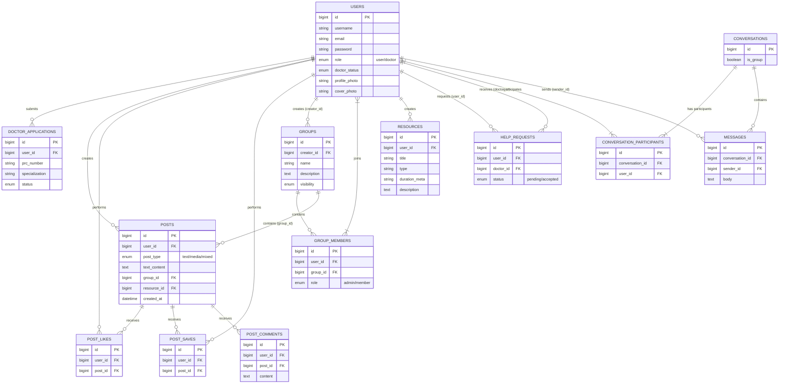

# AskDocPH Database Documentation

## System Flowchart & Entity Relationships

The architecture centers around the core `users` table, which serves two primary roles (`user` vs `doctor`). Almost all auxiliary features attach to the User ID.

## Abstract Data Flow

1. **Authentication Layer**: Handled natively utilizing Laravel routing with `login`, `signup`, `signup-ajax`. State persists via `rememberToken`.
2. **Post Lifecycle**: A User pushes data -> Controllers determine context (`group_id` or `resource_id` mapping if applicable) -> Stored in `posts`.
3. **Social Actions**: Likes (`post_likes`), Comments (`post_comments`), Saves (`post_saves`), and Shares are isolated tables to maintain normalization, pivoting on `user_id` and `post_id`.
4. **Messenger Real-time Sync**: `conversations` -> `conversation_participants` mapping creates logical rooms. Real-time updates occur when `messages` maps to said `conversation_id`.
5. **Medical Routing**: `help_requests` serves as the intermediary handshake protocol connecting a basic user to a certified doctor. Once the `status` moves to `accepted`, logic spins up a unique `conversation` between the two entities.
