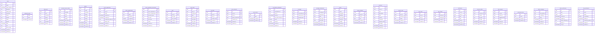

# Supabase Database ER Diagram

```mermaid
erDiagram
    users {
        uuid id PK
        text email
        timestamptz email_verified_at
        text password
        text profile_photo
        text username
        text fname
        text mname
        text lname
        text gender
        timestamptz bday
        text role
        text doctor_status
        timestamptz created_at
        timestamptz updated_at
    }

    password_resets {
        text email
        text token
        timestamptz created_at
    }

    failed_jobs {
        uuid id PK
        text uuid
        text connection
        text queue
        text payload
        text exception
        timestamptz failed_at
    }

    personal_access_tokens {
        uuid id PK
        text tokenable
        text name
        text token
        text abilities
        timestamptz last_used_at
        timestamptz created_at
        timestamptz updated_at
    }

    admins {
        uuid id PK
        text email
        text password
        text fname
        text mname
        text lname
        text gender
        timestamptz bday
        timestamptz created_at
        timestamptz updated_at
    }

    doctor_applications {
        uuid id PK
        uuid user_id FK
        text status
        timestamptz submitted_at
        timestamptz reviewed_at
        uuid reviewed_by_admin_id FK
        text admin_notes
        timestamptz created_at
        timestamptz updated_at
    }

    doctor_requirements {
        uuid id PK
        text name
        text description
        boolean is_required
        timestamptz created_at
        timestamptz updated_at
    }

    doctor_application_documents {
        uuid id PK
        uuid doctor_application_id FK
        uuid doctor_requirement_id FK
        text document_type
        text file_path
        text text_value
        text status
        timestamptz created_at
        timestamptz updated_at
    }

    posts {
        uuid id PK
        uuid user_id FK
        text post_type
        text text_content
        timestamptz created_at
        timestamptz updated_at
    }

    post_media {
        uuid id PK
        uuid post_id FK
        text media_type
        text path
        text mime_type
        int8 size_bytes
        text sort_order
        timestamptz created_at
        timestamptz updated_at
    }

    post_likes {
        uuid id PK
        uuid post_id FK
        uuid user_id FK
        text reaction_type
        timestamptz created_at
        timestamptz updated_at
    }

    post_comments {
        uuid id PK
        uuid post_id FK
        uuid user_id FK
        uuid parent_comment_id FK
        text comment_text
        timestamptz created_at
        timestamptz updated_at
    }

    conversations {
        uuid id PK
        text type
        timestamptz created_at
        timestamptz updated_at
    }

    conversation_participants {
        uuid id PK
        uuid conversation_id FK
        uuid user_id FK
        timestamptz joined_at
        int8 last_read_message_id
        boolean muted
        boolean archived
        timestamptz created_at
        timestamptz updated_at
    }

    messages {
        uuid id PK
        uuid conversation_id FK
        uuid sender_user_id FK
        text message_type
        text body
        timestamptz created_at
        timestamptz updated_at
    }

    message_attachments {
        uuid id PK
        uuid message_id FK
        text media_type
        text path
        text mime_type
        int8 size_bytes
        timestamptz created_at
        timestamptz updated_at
    }

    groups {
        uuid id PK
        text name
        text description
        text guidelines
        text cover_photo
        uuid creator_id FK
        text visibility
        timestamptz created_at
        timestamptz updated_at
    }

    group_members {
        uuid id PK
        uuid group_id FK
        uuid user_id FK
        text role
        timestamptz created_at
        timestamptz updated_at
    }

    resources {
        uuid id PK
        uuid user_id FK
        text title
        text description
        text type
        text content
        text thumbnail
        text duration_meta
        text hashtags
        timestamptz created_at
        timestamptz updated_at
    }

    resource_user {
        uuid id PK
        uuid user_id FK
        uuid resource_id FK
        text status
        timestamptz created_at
        timestamptz updated_at
    }

    post_saves {
        uuid id PK
        uuid user_id FK
        uuid post_id FK
        timestamptz created_at
        timestamptz updated_at
    }

    user_follows {
        uuid id PK
        uuid follower_id FK
        uuid following_id FK
        timestamptz created_at
        timestamptz updated_at
    }

    notifications {
        uuid id PK
        uuid user_id FK
        uuid actor_id FK
        text type
        jsonb data
        timestamptz read_at
        timestamptz created_at
        timestamptz updated_at
    }

    resource_bodies {
        uuid id PK
        uuid resource_id FK
        text content
        text file_path
        text file_type
        timestamptz created_at
        timestamptz updated_at
    }

    help_requests {
        uuid id PK
        uuid user_id FK
        uuid doctor_id FK
        text suggested_title
        text status
        timestamptz created_at
        timestamptz updated_at
    }

    professional_titles {
        uuid id PK
        text name
        timestamptz created_at
        timestamptz updated_at
    }

    admin_messages {
        uuid id PK
        int8 from_admin_id
        int8 to_admin_id
        text body
        timestamptz read_at
        timestamptz created_at
        timestamptz updated_at
    }

    admin_notifications {
        uuid id PK
        text type
        jsonb data
        timestamptz created_at
        timestamptz updated_at
        int8 admin_notification_id
        int8 admin_id
        timestamptz read_at
    }

    daily_affirmations {
        uuid id PK
        text quote
        text author
        boolean is_published
        timestamptz publish_at
        uuid created_by_admin_id FK
        timestamptz created_at
        timestamptz updated_at
    }

```
